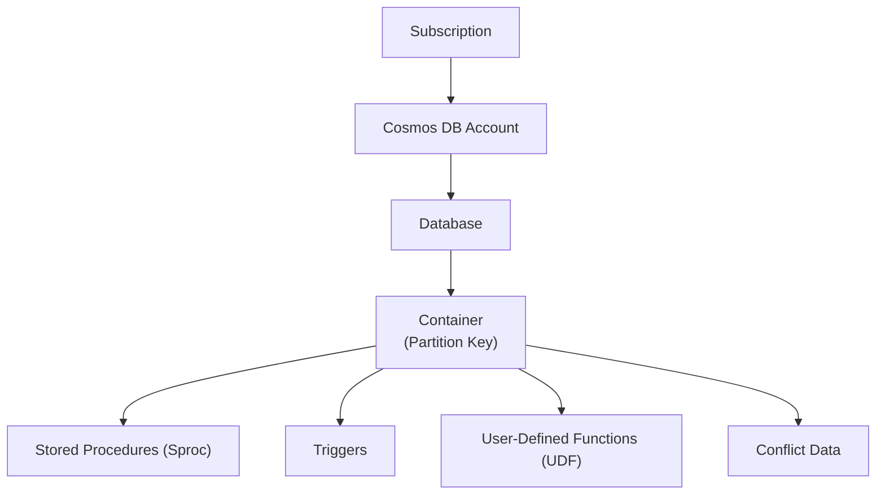

# Azure Cosmos DB for NoSQL

To begin using Azure Cosmos DB for NoSQL, you start by creating various resources within Azure.

**Account:**

- An **account** is the foundational unit for high availability, tenant isolation, and data distribution.
- At the account level, you configure the **region(s)** for your data and access a **globally unique DNS name** for API requests.
- You can also set the **default consistency level** at the account level.
- It's essential to note that a Cosmos DB account must be created under a **Resource Group and Subscription** in Azure.

**Database:**

- Each **account** can contain one or more **databases**.
- A **database** serves as a logical management unit for **containers**.

**Container:**

- Within a **database**, you will find one or more **containers**.
- **Containers** are the fundamental unit of scalability in Azure Cosmos DB for NoSQL.
- You provision **throughput** at the **container** level (though Serverless is also an option).
- Azure Cosmos DB for NoSQL automatically and transparently performs **partitioning** of the data within a container. This partitioning is based on a **partition key path** that you must specify when creating the container. The values of the **partition key** are used to logically divide the data for scale-out.
- You can optionally configure an **indexing policy** or a **default time-to-live (TTL)** value at the container level.
- **Containers** are schema-agnostic and can store arbitrary user-generated **JSON items**. They can also store JavaScript-based **stored procedures, triggers, and user-defined functions (UDFs)**.

**Item:**

- **Items** are the individual documents stored within a **container**, and they are always in **JSON format** for the NoSQL API.
- Azure Cosmos DB for NoSQL natively supports JSON files, which contributes to fast and predictable performance due to atomic write operations on these documents.

## horizontal scaling (scale out)

The primary mechanisms that enable scale out in Cosmos DB are **partitioning** and **replication**.

### Partitioning

Partitioning means distributing data across multiple storage units. improves **latency** and **throughput**.

Cosmos DB employs two types of partitioning: **logical** and **physical**.

- **Physical partitions** represent the underlying **hardware units of storage** located within the Azure region you select.

- **Logical partitions** are formed by grouping items within your dataset based on the value of a **partition key** that you define when creating a **container**.

### Replication

**Replication** in Cosmos DB enhances both **fault tolerance** and **availability**

There are two main types of replication:

- **Within a region:** Data within a single Azure region is automatically replicated **four times** as a redundancy measure.

- **Georeplication into additional Azure regions:** You can choose to replicate your Cosmos DB account and its data into multiple additional Azure regions.
