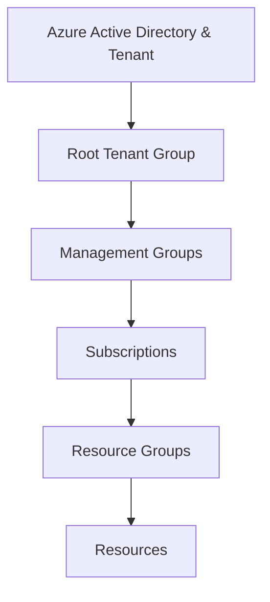

# Azure

## Azure Hierarchy

This is the Hierarchy of Azure to keep in mind:

- Management Groups
- Subscription
- Resource Group
- Resources

Root Tenant Group is a type of Management Group, it is the top most and there can be only 1.

You can nest a Management Group under another Management Group

Subscriptions cannot be used by 2 different Management Groups

## Resources

This article explains Azure Entities Hierarchy and how to manage organizations and environments in Azure

[How to create different environments on Azure - Medium](https://medium.com/bb-tutorials-and-thoughts/how-to-create-different-environments-on-azure-22331d11ea11)
