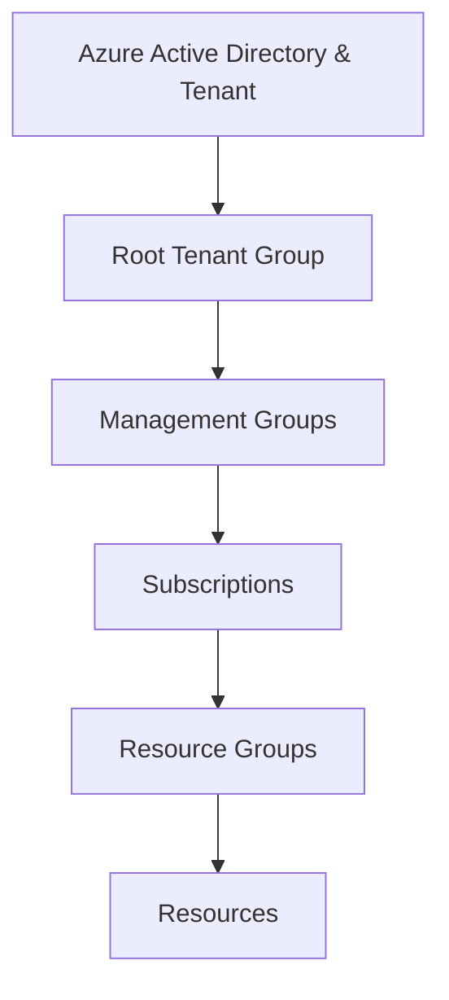

# Azure Infrastructure

## Azure Physical Infrastructure

- Datacenters
- Availability Zones
- Regions
- Region pairs
- Sovereign Regions

## Azure Management Infrastructure

Bottom to top:

- Resources
- Resource Groups
- Subscriptions
- Management Groups
- Root Management Group

## Reading Materials

[How to manage Environments, organizationlal structire, and billing](https://medium.com/bb-tutorials-and-thoughts/how-to-create-different-environments-on-azure-22331d11ea11)
