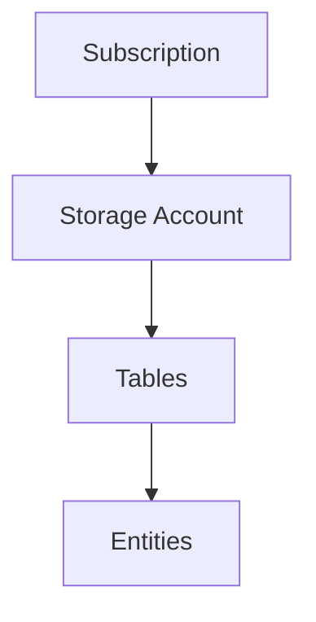

# **Azure Table Storage**

## **Overview**
- **NoSQL, schemaless, non-relational data store**.
- Requires a **Storage Account** for creation and management.

## **Storage Account**
A **Storage Account** provides:
- A globally unique **namespace**.
- **Authentication and security** management.
- **Pricing, redundancy, and scalability** options.

### Hierarchy in Azure

1. **Subscription** (Top-level container)
2. **Storage Account** (Holds all storage services)
3. **Tables** (Collections of entities)
4. **Entities** (Individual records in a table)

## **Entities and Properties**
- An **Entity** is similar to a **row** in a relational database.
- Each entity consists of **key-value pairs** (properties).
- **No predefined schema**, so each entity can have different properties.

## **System Properties**
Each entity has three special **system properties**:

1. **PartitionKey** – Defines a logical partition (must be manually set).
2. **RowKey** – Unique identifier within a partition (must be manually set).
3. **Timestamp** – Auto-managed by Azure, represents the last modification time.

### **Primary Key and Uniqueness**
- The combination of **PartitionKey + RowKey** forms the **primary key**.
- This combination must be **unique** in the table.
- **Azure Table Storage does not enforce uniqueness** but **overwrites existing entities** if the same PartitionKey and RowKey are inserted again.

## **Partition Key Considerations**
- **PartitionKey does not reference another column**; it's just a value used for partitioning data.
- It helps **optimize queries and transactions**.

This is an example of a Table: "Customers"

| PartitionKey | RowKey | Name       | Email                  |
|-------------|--------|------------|------------------------|
| USA         | 001    | John Doe   | john.doe@email.com     |
| USA         | 002    | Jane Smith | jane.smith@email.com   |
| UK          | 001    | Mark Brown | mark.brown@email.com   |

Despite looking weird here "country", not mentioned explicitly as a column name, is set as the partition key. And you should NOT duplicate this information by adding a duplicate column "country".

## Resources

[Microsoft Learn - Table Storage](https://learn.microsoft.com/en-us/azure/storage/tables/)